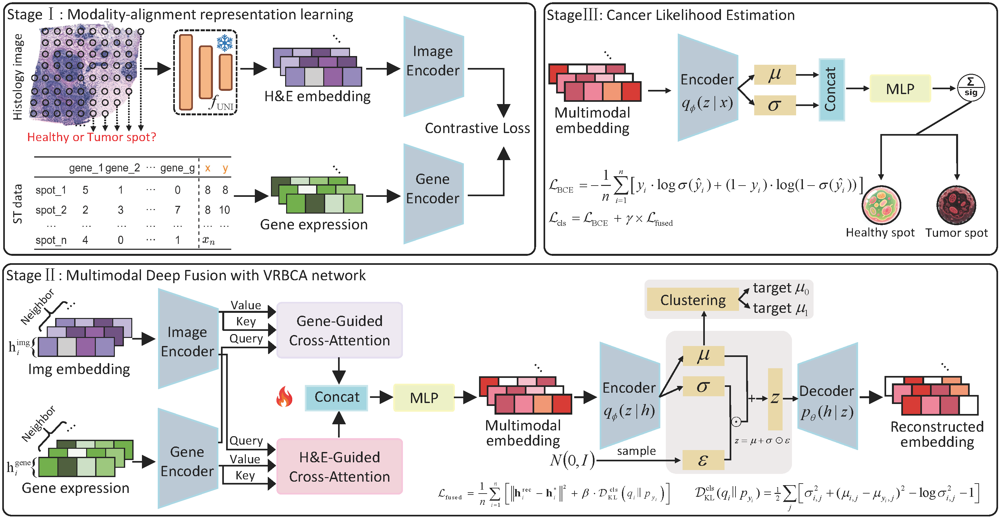

# SpaCRD

## Introduction
Accurate detection of cancer tissue regions (CTR) enables deeper analysis of the tumor microenvironment and offers crucial insights into treatment response. Traditional CTR detection methods, which typically rely on the rich cellular morphology in histology images, are susceptible to a high rate of false positives due to morphological similarities across different tissue regions. The groundbreaking advances in spatial transcriptomics (ST) provide detailed cellular phenotypes and spatial localization information, offering new opportunities for more accurate cancer region detection. However, current methods are unable to effectively integrate histology images with ST data, especially in the context of cross-sample and cross-platform/batch settings for accomplishing the CTR detection. To address this challenge, we propose SpaCRD, a transfer learning-based method that deeply integrates histology images and ST data to enable reliable CTR detection across diverse samples, platforms, and batches. Once trained on source data, SpaCRD can be readily generalized to accurately detect cancerous regions across samples from different platforms and batches. The core of SpaCRD is a category-regularized variational reconstruction-guided bidirectional cross-attention fusion network, which enables the model to adaptively capture latent co-expression patterns between histological features and gene expression from multiple perspectives. Extensive benchmark analysis on 23 matched histology-ST datasets spanning various disease types, platforms, and batches demonstrates that SpaCRD consistently outperforms existing eight state-of-the-art methods in CTR detection.



## Requirements
All experiments were conducted on an NVIDIA RTX 3090 GPU. Before running SpaCRD, you need to create a conda environment and install the required packages:
```shell
conda create -n SpaCRD python==3.11.5
conda activate SpaCRD
pip install -r requirements.txt
```

## Original publications of all datasets
The ST human HER2-positive breast tumor datasets (STHBC) are available in: [https://github.com/almaan/her2st](https://github.com/almaan/her2st).

The 10X Visium Colorectal Cancer Visium datasets are available in: [https://zenodo.org/records/7760264](https://zenodo.org/records/7760264).

The 10X Visium Invasive Ductal Carcinoma dataset (IDC) are available in: [https://www.10xgenomics.com/datasets/invasive-ductal-carcinoma-stained-with-fluorescent-cd-3-antibody-1-standard-1-2-0](https://www.10xgenomics.com/datasets/invasive-ductal-carcinoma-stained-with-fluorescent-cd-3-antibody-1-standard-1-2-0).

The Xenium Human Breast Cancer dataset (XeHBC) can be found at: [https://www.10xgenomics.com/products/xenium-in-situ/preview-dataset-human-breast](https://www.10xgenomics.com/products/xenium-in-situ/preview-dataset-human-breast).

The 10X Visium Human Breast Cancer dataset (ViHBC) are available in: [https://zenodo.org/records/10437391](https://zenodo.org/records/10437391).

## Pre-trained mode UNI
Given the outstanding performance of large pre-trained general-purpose foundation models in clinical tasks, we use UNI as the backbone feature extractor. Before using SpaCRD, you need to apply to UNI for permission to access the model weights: [https://huggingface.co/mahmoodlab/UNI](https://huggingface.co/mahmoodlab/UNI).
Please follow these steps to integrate UNI into the pipeline:
- Log in to Hugging Face and obtain your **access token**.
- Paste your token into the 32 line of code in [`UNI_histology_extractor.py`](UNI_histology_extractor.py):
     ```python
   login('The login you need to apply for')  # Replace with your actual token
- Once the token is inserted, the model weights will be automatically downloaded when you run the code.
🔒 Note: Do not share your token publicly. It is tied to your Hugging Face account and grants access to restricted models.
